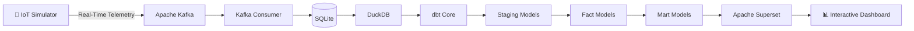

# 🌍 AtmoSync – Real-Time Micro-Climate Supply Chain Analytics

> A real-time data engineering and analytics platform that monitors perishable commodity shipments using streaming IoT telemetry, transforms raw events into analytics-ready datasets with dbt, and visualizes live operational insights using Apache Superset.


---

## 🚀 Project Overview

AtmoSync simulates a fleet of refrigerated shipping containers transporting temperature-sensitive commodities across India.

The platform continuously streams IoT sensor data, processes the incoming events through an ELT pipeline, enriches the data with market pricing information, and delivers live operational dashboards for monitoring container health, spoilage risk, routing decisions, and historical trends.

This project demonstrates a modern Data Engineering workflow using streaming ingestion, analytical data modeling, and business intelligence visualization.

---

## ✨ Features

- 📡 Real-time IoT telemetry simulator
- ⚡ Apache Kafka streaming pipeline
- 💾 Event persistence into DuckDB
- 🔄 ELT transformations with dbt Core
- 📊 Interactive dashboards using Apache Superset
- 🌡 Container health monitoring
- 📉 Spoilage prediction analytics
- 🚚 Reroute recommendation tracking
- 📍 Live container location visualization

---

# 🛠️ Tech Stack

| Category | Technology |
|-----------|------------|
| Language | Python 3.13 |
| Streaming | Apache Kafka |
| Database | DuckDB |
| Data Transformation | dbt Core |
| Data Modeling | SQL |
| Dashboard | Apache Superset |
| Containerization | Docker |
| Version Control | Git & GitHub |

---

# 🏗️ System Architecture

The following diagram illustrates the complete end-to-end data pipeline used in AtmoSync.



---

# 📂 Repository Structure

```text
AtmoSync/
│
├── dbt/
│   └── atmosync/
│       ├── models/
│       │   ├── staging/
│       │   ├── intermediate/
│       │   └── marts/
│       ├── seeds/
│       ├── macros/
│       ├── snapshots/
│       ├── tests/
│       ├── dbt_project.yml
│       └── packages.yml
│
├── docs/
│   ├── README.md
│   ├── screenshots/
│   └── dashboard_export/
│
├── images/
│
├── kafka/
│   ├── kafka_consumer.py
│   ├── kafka_producer.py
│   └── iot_simulator.py
│
├── scripts/
│   └── migrate_sqlite_to_duckdb.py
│
├── storage/
│   ├── kafka_to_sqlite.py
│   ├── atmosync.db
│   └── atmosync.duckdb
│
├── superset/
│
├── .gitignore
├── docker-compose.yml
├── LICENSE
├── README.md
└── requirements.txt
```

---

# 🔄 Data Pipeline Flow

AtmoSync follows a modern ELT (Extract, Load, Transform) architecture to process real-time IoT telemetry from refrigerated shipping containers.

## Step 1 — IoT Data Simulation 📡

A Python-based IoT simulator continuously generates realistic telemetry for multiple shipping containers, including:

- Container ID
- Commodity
- GPS Coordinates
- Temperature
- Humidity
- Vibration
- Spoilage Percentage
- Recommended Market
- Timestamp

Each record represents a live sensor reading generated every few seconds.

---

## Step 2 — Event Streaming ⚡

The simulator publishes every telemetry event to an Apache Kafka topic.

Kafka acts as the event streaming platform, enabling high-throughput, real-time data ingestion while decoupling data producers from downstream consumers.

---

## Step 3 — Event Persistence 💾

A Python Kafka Consumer subscribes to the telemetry topic and continuously stores incoming events into a local SQLite database.

SQLite serves as the project's raw operational data store.

---

## Step 4 — Analytical Storage 🦆

The SQLite database is migrated into DuckDB, providing a high-performance analytical database optimized for OLAP-style queries.

This database becomes the source for all analytical transformations.

---

## Step 5 — Data Transformation 🔄

dbt Core transforms the raw IoT events into analytics-ready models through a layered architecture:

- **Staging Layer** – Cleans and standardizes raw telemetry.
- **Intermediate Layer** – Creates business-focused fact tables.
- **Mart Layer** – Produces reporting-ready datasets for dashboards.

Mock commodity pricing data is also integrated during this stage to enrich business insights.

---

## Step 6 — Business Intelligence 📊

Apache Superset connects directly to the transformed DuckDB models to provide interactive dashboards for monitoring:

- Container Health
- Historical Temperature Trends
- Average Spoilage
- Live Container Locations
- Reroute Alerts
- Commodity Market Insights

The dashboard updates whenever new telemetry is processed through the pipeline.
